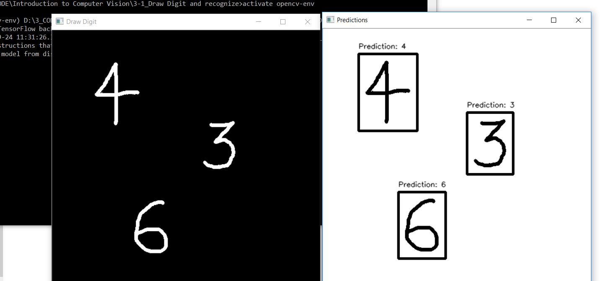

# Digit-Localization-and-Identification

Identifying few strokes on a piece of paper to be number may seem to be a piece of cake for us humans, thanks to millions of years of evolution and a highly evolved brain, but for a computer, this task can be really daunting.

In this project, I trained a convolutional neural network to identify digits. Then I took it a step further by writing another program which can locate digits in a picture and then identify that them.

## Draw digit

Draw digit is an extended application that uses the digit localization and identification model. running Draw.py will open up a window which allows the users to draw digit(s) in it using a mouse. once the drawing is finished, pressing the escape ket opens up a new window with the predictions of these digits.

